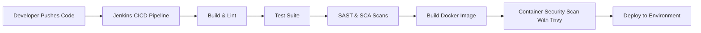

# DevSecOps Pipeline for Node.js Application

Welcome to the **DevSecOps-Pipeline-For-Node-App** repository! This project demonstrates a comprehensive, production-ready DevSecOps pipeline tailored for Node.js applications. It integrates Continuous Integration (CI), Continuous Deployment (CD), security checks, and best practices to automate secure software delivery.

---

## Table of Contents

- [Introduction](#introduction)
- [Features](#features)
- [Architecture](#architecture)
- [Technologies Used](#technologies-used)
- [Getting Started](#getting-started)
  - [Prerequisites](#prerequisites)
  - [Installation](#installation)
  - [Configuration](#configuration)
  - [Usage](#usage)
- [CI/CD Pipeline Breakdown](#cicd-pipeline-breakdown)
  - [Code Quality & Linting](#code-quality--linting)
  - [Unit & Integration Tests](#unit--integration-tests)
  - [Security Scanning](#security-scanning)
  - [Dependency Management](#dependency-management)
  - [Containerization & Deployment](#containerization--deployment)
- [Security Practices](#security-practices)
- [Best Practices](#best-practices)
- [Contributing](#contributing)
- [License](#license)
- [Contact](#contact)

---

## Introduction

This repository provides a full-fledged DevSecOps pipeline for a Node.js application. It automates code building, testing, security scanning, containerization, and deployment, ensuring rapid and reliable delivery of secure software.

## Features

- Automated CI/CD pipeline with GitHub Actions
- Static Application Security Testing (SAST)
- Dependency vulnerability scanning (SCA)
- Container security scanning
- Unit, integration, and end-to-end testing
- Linting and code formatting
- Containerization with Docker
- Infrastructure as Code (IaC) support
- Deployment to cloud platforms (customizable)
- Secrets management
- Detailed documentation

## Architecture



## Technologies Used

- **Node.js**: Application runtime
- **GitHub Actions**: CI/CD automation
- **ESLint/Prettier**: Linting and formatting
- **Jest/Mocha**: Testing frameworks
- **OWASP Dependency-Check / npm audit**: Dependency scanning
- **SonarQube / CodeQL**: Static code analysis
- **Trivy / Snyk**: Container and code scanning
- **Docker**: Containerization
- **Terraform/CloudFormation**: (Optional) IaC
- **Secrets Management**: GitHub Secrets or HashiCorp Vault

## Getting Started

### Prerequisites

- Node.js >= 14.x
- Docker
- GitHub account
- (Optional) Cloud provider credentials (AWS, Azure, GCP)

### Installation

1. **Clone the repository:**
   ```sh
   git clone https://github.com/elonerajeev/DevSecOps-Pipeline-For-Node-App.git
   cd DevSecOps-Pipeline-For-Node-App
   ```

2. **Install dependencies:**
   ```sh
   npm install
   ```

### Configuration

- Configure environment variables in a `.env` file or via GitHub Secrets.
- Update pipeline configuration files in `.github/workflows/` as needed.
- (Optional) Set up cloud provider credentials for deployment.

### Usage

- **Development:**  
  Start the app locally:
  ```sh
  npm run dev
  ```

- **Run tests:**  
  ```sh
  npm test
  ```

- **Lint code:**  
  ```sh
  npm run lint
  ```

- **Build Docker image:**  
  ```sh
  docker build -t node-app .
  ```

- **Trigger CI/CD pipeline:**  
  Push code to GitHub; the pipeline will run automatically.

## CI/CD Pipeline Breakdown

### Code Quality & Linting

- Automated linting with ESLint and formatting with Prettier.
- Ensures consistent code style and catches common errors.

### Unit & Integration Tests

- Tests executed via Jest/Mocha.
- Includes coverage reporting.

### Security Scanning

- **SAST:** CodeQL/SonarQube analyze code for vulnerabilities.
- **Dependency Scanning:** `npm audit`, OWASP Dependency-Check scan for vulnerable packages.
- **Container Scan:** Trivy/Snyk scan Docker images for vulnerabilities.

### Dependency Management

- Automated updates using Dependabot (optional).
- Lockfile maintained for reproducibility.

### Containerization & Deployment

- Application is built into a Docker image.
- (Optional) Pushed to a container registry.
- Automated deployment using IaC tools or platform-specific scripts.

## Security Practices

- Use of secrets management for sensitive credentials.
- Automated static and dynamic security checks.
- Minimal base images and least privilege principle in Dockerfiles.
- Regularly updated dependencies.

## Best Practices

- Branch protection and required status checks in GitHub.
- Automated test and security gates.
- Infrastructure as Code for reproducible environments.
- Continuous monitoring and alerting for vulnerabilities.

## Contributing

Contributions are welcome! Please open issues or pull requests to suggest features, improvements, or bug fixes. See [CONTRIBUTING.md](CONTRIBUTING.md) for guidelines.

## License

This project is licensed under the [MIT License](LICENSE).

## Contact

- **Author:** [elonerajeev](https://github.com/elonerajeev)
- **Repository:** [DevSecOps-Pipeline-For-Node-App](https://github.com/elonerajeev/DevSecOps-Pipeline-For-Node-App)

---

*Happy Secure Shipping!* 🚀
