# 🚀 DevSecOps Pipeline for Node.js Application

<div align="center">


  <h3>🔒 Production-Ready DevSecOps Pipeline with Comprehensive Security Integration</h3>

  <p>
    <a href="#-features">Features</a> •
    <a href="#-quick-start">Quick Start</a> •
    <a href="#-pipeline-stages">Pipeline Stages</a> •
    <a href="#-security-tools">Security Tools</a> •
    <a href="#-deployment">Deployment</a>
  </p>

</div>


---

## 🎯 Overview

This repository demonstrates a **comprehensive, production-ready DevSecOps pipeline** tailored for Node.js applications. It integrates multiple security scanning tools, automated testing, and deployment workflows to ensure **secure, reliable, and rapid software delivery**.

### 🌟 What Makes This Special?

- 🔐 **4-Layer Security Scanning**: SAST, SCA, Container Scanning, and DAST
- ⚡ **Automated CI/CD**: Zero-touch deployments
- 🐳 **Container-First**: Docker-based application packaging
- 📊 **Comprehensive Reporting**: Detailed security and quality reports
- 🛡️ **Production-Ready**: Best practices for enterprise environments

---

## 🚀 Features

### 🔒 Security Features

- **Static Application Security Testing (SAST)** with SonarQube
- **Software Composition Analysis (SCA)** with OWASP Dependency-Check
- **Container Security Scanning** with Trivy
- **Dynamic Application Security Testing (DAST)** with OWASP ZAP
- **Secrets Management** with secure credential handling

### 🔄 CI/CD Features

- **Automated Testing** with Mocha/Jest
- **Code Quality Gates** with ESLint and SonarQube
- **Docker Image Building** and Registry Push
- **Pipeline Notifications** and reporting

### 📊 Monitoring & Reporting (Working)

- **HTML Security Reports** for all scans
- **Build Status Notifications**
- **Deployment Tracking**
- **Performance Metrics**

---

## 🏗️ Architecture

```mermaid
graph TD
    A[🔄 Code Push] --> B[📋 Jenkins Pipeline Trigger]
    B --> C[🧪 Unit Tests]
    C --> D[🔍 SonarQube SAST]
    D --> E[📦 OWASP Dependency Check]
    E --> F[🐳 Docker Build]
    F --> G[🛡️ Trivy Container Scan]
    G --> H[🚀 Deploy to Environment]
    H --> I[🕷️ OWASP ZAP DAST]
    I --> J[📊 Generate Reports]

    style A fill:#e1f5fe
    style B fill:#f3e5f5
    style C fill:#e8f5e8
    style D fill:#fff3e0
    style E fill:#fce4ec
    style F fill:#e3f2fd
    style G fill:#f1f8e9
    style H fill:#e8eaf6
    style I fill:#fff8e1
    style J fill:#e0f2f1
```



---

## 🛠️ Tech Stack

<table>
<tr>
<td align="center" width="25%">

### 🔧 CI/CD Tools


</td>
<td align="center" width="25%">

### 🔒 Security Tools


</td>
<td align="center" width="25%">

### 🐳 Container & Cloud


</td>
<td align="center" width="25%">

### 💻 Development


</td>
</tr>
</table>

---

## 🚀 Quick Start

### 📋 Prerequisites

- **Node.js** >= 16.x
- **Docker** >= 20.x
- **Jenkins** with required plugins
- **Git** for version control

### 🔧 Installation

1. **Clone the repository:**

   ```bash
   git clone https://github.com/elonerajeev/DevSecOps-Pipeline-For-Node-App.git
   cd DevSecOps-Pipeline-For-Node-App
   ```

2. **Install dependencies:**

   ```bash
   npm install
   ```

3. **Set up environment:**

   ```bash
   cp .env.example .env
   # Edit .env with your configuration
   ```

4. **Run the setup script:**
   ```bash
   chmod +x script.sh
   ./script.sh
   ```

### 🏃‍♂️ Local Development

```bash
# Start the application
npm start

# Run tests
npm test

# Run linting
npm run lint

# Build Docker image
docker build -t node-app .
```

---

## 🔄 Pipeline Stages

<details>
<summary><b>📊 Click to view detailed pipeline stages</b></summary>

### 1. 🔍 **Code Quality & Testing**

- **Unit Tests**: Automated test execution with coverage reporting
- **Linting**: Code style and quality checks with ESLint
- **Build Validation**: Ensure application builds successfully

### 2. 🛡️ **Security Scanning Phase**

#### 🔒 **SAST (Static Application Security Testing)**

- **Tool**: SonarQube
- **Purpose**: Analyze source code for vulnerabilities
- **Gate**: Fails pipeline if critical issues found

#### 📦 **SCA (Software Composition Analysis)**

- **Tool**: OWASP Dependency-Check
- **Purpose**: Scan dependencies for known vulnerabilities
- **Output**: HTML report with remediation suggestions

#### 🐳 **Container Security Scanning**

- **Tool**: Trivy
- **Purpose**: Scan Docker images for vulnerabilities
- **Severity**: Fails on CRITICAL and HIGH vulnerabilities

### 3. 🚀 **Build & Deploy**

- **Docker Build**: Create optimized container images
- **Registry Push**: Secure push to Docker Hub
- **Deployment**: Automated deployment to target environment

### 4. 🕷️ **DAST (Dynamic Application Security Testing)**

- **Tool**: OWASP ZAP
- **Purpose**: Test running application for vulnerabilities
- **Scope**: Full application security assessment

</details>

---

## 🔒 Security Tools Integration

| Tool                          | Type               | Purpose                             | Report Format  |
| ----------------------------- | ------------------ | ----------------------------------- | -------------- |
| 🔍 **SonarQube**              | SAST               | Code quality & security analysis    | Web Dashboard  |
| 📦 **OWASP Dependency-Check** | SCA                | Dependency vulnerability scanning   | HTML Report    |
| 🐳 **Trivy**                  | Container Security | Docker image vulnerability scanning | Console Output |
| 🕷️ **OWASP ZAP**              | DAST               | Dynamic application testing         | HTML Report    |

---

## 🚀 Deployment

### 🐳 Docker Deployment

```bash
# Build and run locally
docker build -t node-app .
docker run -p 3000:3000 node-app
```

### ☁️ Cloud Deployment

The pipeline supports deployment to:

- **AWS ECS/EKS**
- **Azure Container Instances**
- **Google Cloud Run**
- **On-premises Kubernetes**

---

## 📊 Reports & Monitoring

### 📈 **Available Reports**

- 🔍 **SonarQube Quality Gate**: Code quality metrics
- 📦 **Dependency Scan Report**: Vulnerability details and fixes
- 🕷️ **ZAP Security Report**: Dynamic security testing results
- 🐳 **Trivy Container Report**: Image vulnerability assessment

### 🔔 **Notifications**

- Email notifications for pipeline status
- Slack integration for team updates
- GitHub status checks for PR validation

---

## 🤝 Contributing

We welcome contributions! Please see our [Contributing Guidelines](CONTRIBUTING.md) for details.

1. **Fork the repository**
2. **Create a feature branch**
3. **Make your changes**
4. **Add tests if applicable**
5. **Submit a pull request**

---

## 📝 Best Practices Implemented

- ✅ **Security-First Approach**: Multiple security scanning layers
- ✅ **Fail-Fast Strategy**: Early detection of issues
- ✅ **Automated Testing**: Comprehensive test coverage
- ✅ **Container Security**: Secure base images and scanning
- ✅ **Secrets Management**: No hardcoded credentials
- ✅ **Infrastructure as Code**: Version-controlled infrastructure
- ✅ **Monitoring & Alerting**: Comprehensive observability

---

## 📞 Support & Contact

<div align="center">

**👨‍💻 Created by [Rajeev Kumar (elonerajeev)](https://github.com/elonerajeev)**

[](https://www.linkedin.com/in/rajeev-kumar-2209b1243/)
[](https://github.com/elonerajeev)
[](https://rajeevxportfolio.netlify.app/)

</div>

---

## 📄 License

This project is licensed under the **MIT License** - see the [LICENSE](LICENSE) file for details.

---

<div align="center">

### 🌟 If this project helped you, please consider giving it a star! ⭐

**Happy Secure Coding!** 🚀🔒

</div>
