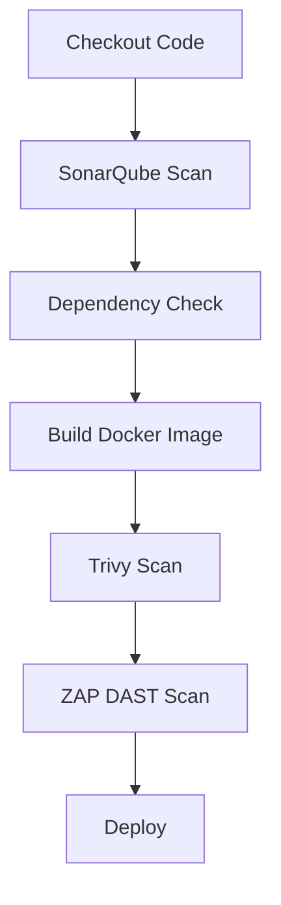

# Jenkins DevSecOps Pipeline Setup Guide

## Prerequisites

- Jenkins server with admin access
- Docker installed on the server
- GitHub repository with your project code

---

## 1. Server Package Installation

Run these commands on your Jenkins server:

```bash
chmod u+x script.sh
./script.sh
```

---

## 2. Jenkins Plugins Installation

Navigate to:
**Jenkins Dashboard → Manage Jenkins → Plugins → Available Plugins**

Install these plugins:

- ✅ SonarQube Scanner (`sonarqube-scanner`)
- ✅ OWASP Dependency-Check (`dependency-check-jenkins-plugin`)
- ✅ Email Extension (`email-ext`)
- ✅ Docker Pipeline (`docker-workflow`)
- ✅ HTML Publisher (`htmlpublisher`)
- ✅ Blue Ocean (`blueocean`) - Optional (for pipeline visualization)

---

## 3. Global Tool Configuration

**Jenkins → Manage Jenkins → Tools**

| Tool                   | Name                     | Installation Method           |
| ---------------------- | ------------------------ | ----------------------------- |
| SonarQube Scanner      | `sonar-scanner`          | Install automatically         |
| OWASP Dependency-Check | `owasp-dependency-check` | Path: `/opt/dependency-check` |
| Trivy                  | `trivy`                  | Path: `/usr/local/bin/trivy`  |

---

## 4. Credentials Setup

**Jenkins → Manage Jenkins → Credentials → System → Global Credentials**

| Credential Type   | ID                | Description                  |
| ----------------- | ----------------- | ---------------------------- |
| Secret Text       | `sonarqube-token` | SonarQube API token          |
| Username/Password | `dockerhub`       | Docker Hub credentials       |
| Secret Text       | `zap-api-key`     | OWASP ZAP API key (optional) |
| Username/Password | `smtp-creds`      | Email server credentials     |

---

## 5. System Configuration

**Jenkins → Manage Jenkins → System Configuration**

### A. SonarQube Servers

- **Name**: `sonarqube-server`
- **Server URL**: `http://localhost:9000` (or your SonarQube instance)
- **Authentication Token**: Select `sonarqube-token` credential

### B. Email Notification

```plaintext
SMTP server: smtp.gmail.com
☑️ Use SMTP Authentication
Username: your-email@gmail.com
Password: [App Password]
Default Recipients: team@yourdomain.com
```

---

## 6. Pipeline Configuration

### A. SonarQube Project Setup

1. Access SonarQube at `http://localhost:9000`
2. Create project manually → Generate token under **User → Security**

### B. OWASP ZAP Setup

```bash
# Start ZAP in daemon mode
docker run -d --name zap -p 8080:8080 owasp/zap2docker-stable zap-webswing.sh
```

### C. Pipeline Environment Variables

Add these to your `Jenkinsfile`:

```groovy
environment {
    SONARQUBE_TOKEN = credentials('sonarqube-token')
    DOCKER_CREDENTIALS = credentials('dockerhub')
    API_URL = 'http://your-app-address:3000'
}
```

---

## Troubleshooting Tips

### Common Issues

1. **Docker Permission Denied**

   ```bash
   sudo usermod -aG docker jenkins
   sudo systemctl restart jenkins
   ```

2. **SonarQube Connection Issues**

   - Verify token is valid
   - Check SonarQube server logs: `docker logs sonarqube`

3. **Email Not Sending**
   - Test SMTP settings using "Test configuration" button
   - For Gmail, ensure "Less secure apps" is enabled or use App Password

---

## Visual Pipeline Flow



---

## Recommended Tools Version

| Tool      | Version    |
| --------- | ---------- |
| SonarQube | LTS (9.9+) |
| OWASP ZAP | Stable     |
| Trivy     | Latest     |

```

This Markdown document provides:
1. Clear step-by-step instructions
2. Code blocks for commands
3. Tables for configuration
4. Visual troubleshooting guide
5. Mermaid diagram for pipeline flow

You can save this as `Jenkins-DevSecOps-Setup.md` for team reference or documentation purposes.
```
